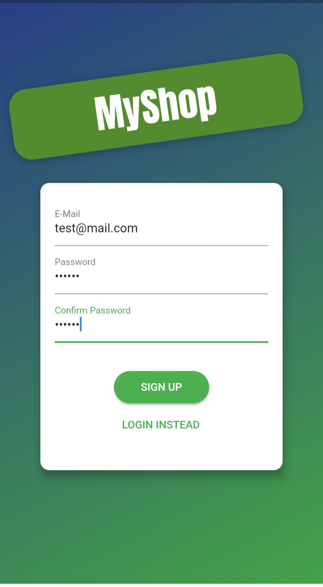
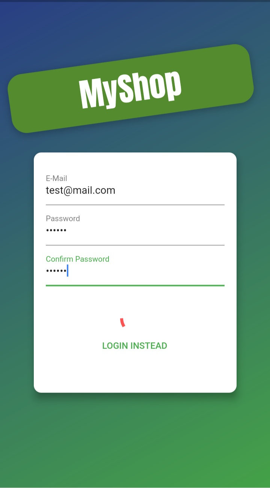
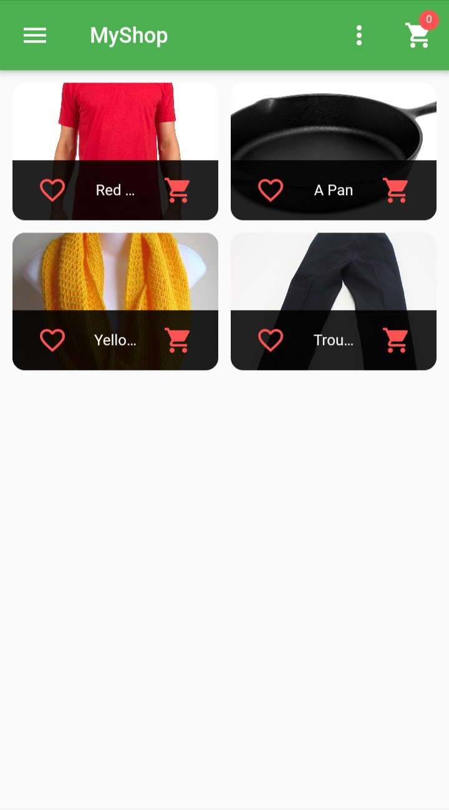
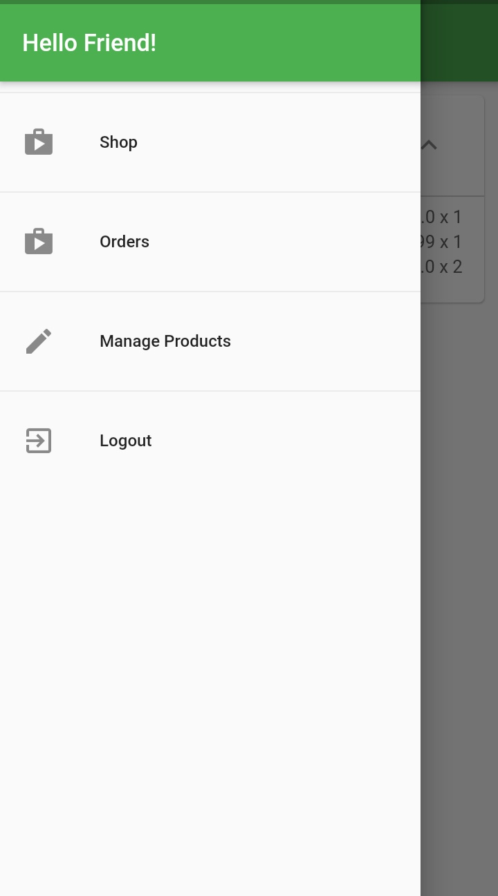
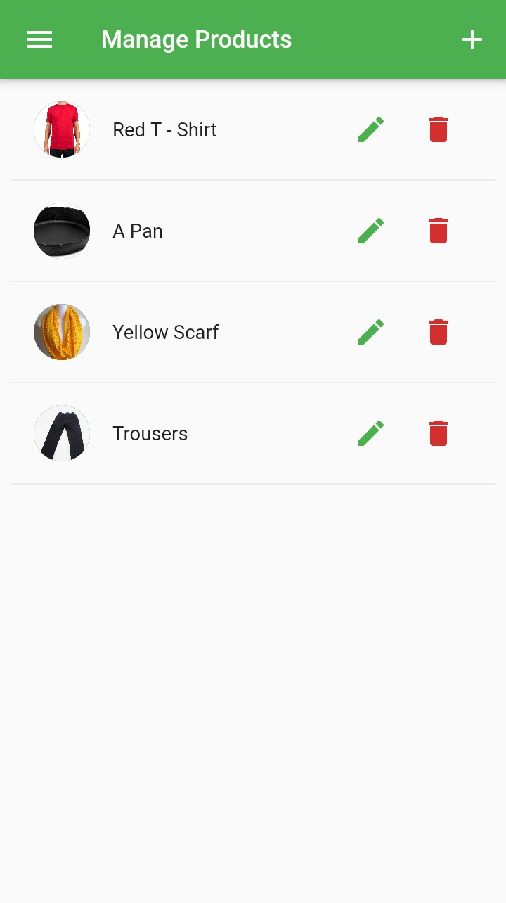
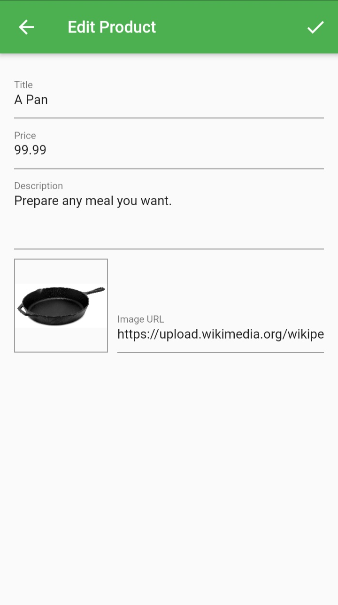
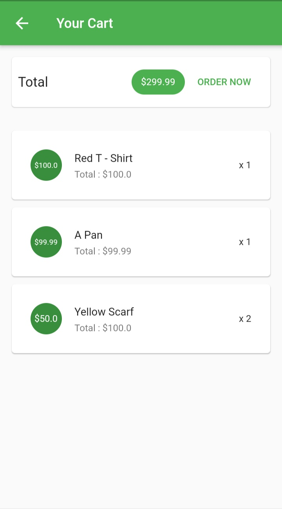
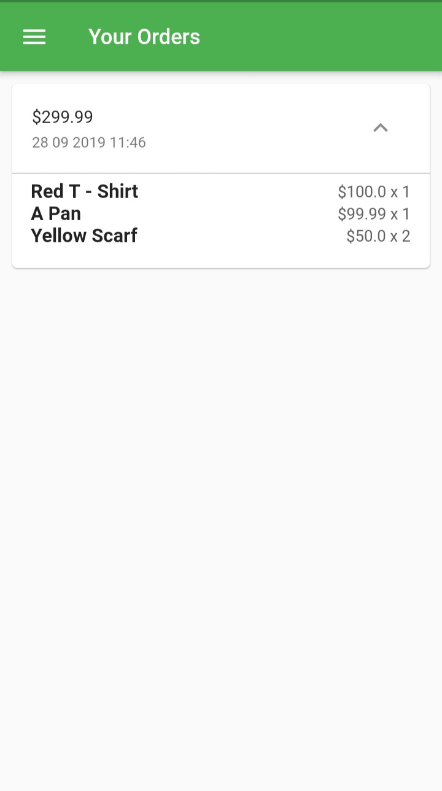

# Flutter E-Commerce

> A flutter application for beautiful E-commerce UI App with provider pattern.

Main Features Used :
- Beautiful UI Design
- Firebase Database
- Firebase Authentication
- Data Fetching From Network
- ImagePicker
- Provider Package
- Future Builder

## Screenshots

| 1 | 2|
|------|-------|
|||

| 3 | 4|
|------|-------|
|||

| 5 | 6|
|------|-------|
|||

| 7 | 8|
|------|-------|
|||
